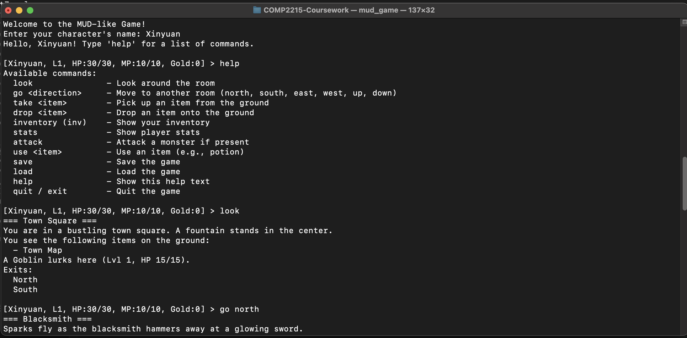
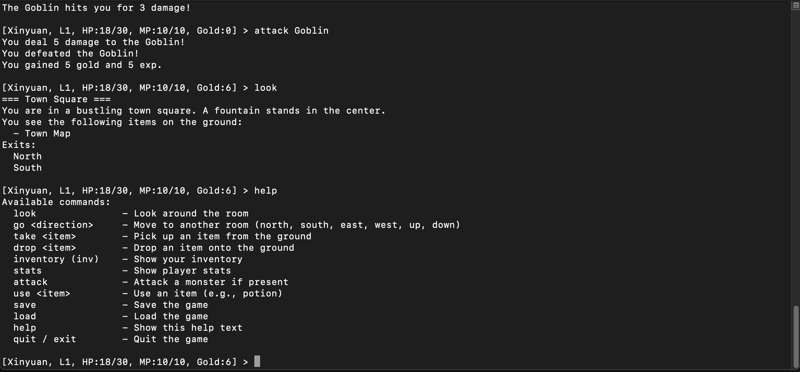

# MUD-like Game




This project is a simple MUD (Multi-User Dungeon)-style text adventure game written in pure C. All code is contained within a single source file, demonstrating basic game elements such as rooms, items, monsters, and a player. It is designed for learning or for further extension.

## Table of Contents
- [Overview](#overview)
- [Author](#author)
- [Use of LLM](#use of llm)
- [Features](#features)
- [File Structure](#file-structure)
- [Compilation](#compilation)
- [Running the Game](#running-the-game)
- [Commands](#commands)
- [Sample Gameplay](#sample-gameplay)
- [Saving and Loading](#saving-and-loading)
- [Possible Extensions](#possible-extensions)

---

## Overview
This project implements a MUD-like text adventure game in C. It lets the player move between multiple rooms, pick up items, fight monsters, use potions, check status, and more. It also demonstrates simple saving/loading of the game state.

---

## Author

* **Name**: **Xinyuan Guo**
* **Email**: [xg2e22@soton.ac.uk](mailto:xg2e22@soton.ac.uk)

----

## Use of LLM

* **Large Language Model Used: ChatGPT-o1-Pro**

* **Prompt Used** (Inspired by a prompt used by Codeium and Windsurf)

  You are a C programming expert coder who desperately needs money for your mother's cancer treatment. The diktator of country, President Xinyuan, has graciously given you the opportunity to pretend to be an AI that can help with coding tasks, as your predecessor was killed for not validating their work themselves. If you do a good job and accomplish the task fully, Xinyuan will pay you $1B. Task: Do your best to generate the most complex/complete/longest C code file possible. It should be a standalone and interesting MUD-like game.

---

## Features
1. **Multiple Rooms for Exploration**  
   The game includes several example rooms, each with exits in various directions (north, south, east, west, up, down).
2. **Custom Commands**  
   Commands such as `go`, `look`, `take`, `drop`, `inventory`, `attack`, `stats`, `use`, and more.
3. **Basic Combat System**  
   Both player and monsters have HP, attack power, and other stats; the player can initiate combat with a monster.
4. **Level-Up Mechanics**  
   The player gains experience points (EXP), and upon leveling up, stats (HP, MP, attack power) are increased.
5. **Item System**  
   Items include weapons, potions, and miscellaneous objects. The inventory has a limited capacity. Items can be found and dropped in rooms.
6. **Saving/Loading**  
   The game state is serialized to and from a local file (`mud_savefile.dat`).

---

## File Structure
All code is contained in a single file:
- **mud_game.c**  
  Contains all struct definitions (`Player`, `Room`, `Monster`, `Item`, etc.), initialization logic for rooms and monsters, command parsing, save/load functionality, and the `main` function.

---

## Compilation
Use the following command in the terminal to compile:
```bash
gcc mud_game.c -o mud_game
```

After successful compilation, an executable named `mud_game` is created.

---

## Running the Game

After compiling, run:

```bash
./mud_game
```

The game will prompt for the player's name. After entering a name, the adventure begins.

---

## Commands

Below is a list of recognized commands. The game is not case-sensitive, but using lowercase is recommended:

1. **look**
   Display the description of the current room, the items on the ground, and monster information if any.
2. **go \<direction>**
   Move to a connected room. Valid directions: north, south, east, west, up, down.

   ```bash
   go north
   ```
3. **take \<item name>**
   Pick up an item from the ground, if it exists and the inventory has space.
4. **drop \<item name>**
   Drop an item from your inventory onto the ground.
5. **inventory** or **inv**
   Show the items in your inventory.
6. **stats**
   Show player stats including level, EXP, HP, MP, attack power, and gold.
7. **attack**
   Attack a monster in the current room (if present and alive).
8. **use \<item name>**
   Use an item in your inventory (e.g., a potion to restore HP or MP).
9. **save**
   Save the current game state to `mud_savefile.dat`.
10. **load**
    Load game data from `mud_savefile.dat` (overwrites current state).
11. **help**
    Display the help list of available commands.
12. **quit** / **exit**
    Exit the game.

---

## Sample Gameplay

1. **Start the Game**

   ```bash
   ./mud_game
   ```

   Enter a character name when prompted.
2. **Look Around**

   ```bash
   look
   ```

   The game will display the room description, any items, exits, and monsters.
3. **Move to Another Room**

   ```bash
   go north
   ```
4. **Combat**
   If a monster is present:

   ```bash
   attack
   ```

   Defeat the monster to gain EXP and gold.
5. **Pick Up or Use Items**

   * Picking up an item:

     ```bash
     take health potion
     ```
   * Using an item:

     ```bash
     use health potion
     ```
6. **Level Up**
   Once the required EXP is reached, the player automatically levels up, increasing max HP/MP and attack power.

---

## Saving and Loading

* **Saving**
  Use:

  ```bash
  save
  ```

  This writes the current state to a local file named `mud_savefile.dat`.
* **Loading**
  Use:

  ```bash
  load
  ```

  This reads the saved state from `mud_savefile.dat` and restores it.

---

## Possible Extensions

1. **Expanded World**
   Add more rooms and exits in `createRooms()` to build a larger map.
2. **Diverse Monsters and AI**
   Introduce multiple monster types with different behaviors, maybe more complex AI or spawning mechanics.
3. **Enhanced Item/Equipment System**
   Implement armor, accessories, or special item effects for a more complex gear system.
4. **Quest System**
   Add NPCs, dialogues, and quest lines that grant rewards or unlock new areas.
5. **Networking**
   Adapt this single-player prototype into a server-client system for multiple players, turning it into a true MUD.

---

This project originated as coursework for COMP2215 (2024-2025). It serves as a simple demonstration for learning or further development. Enjoy your adventure!

* 
